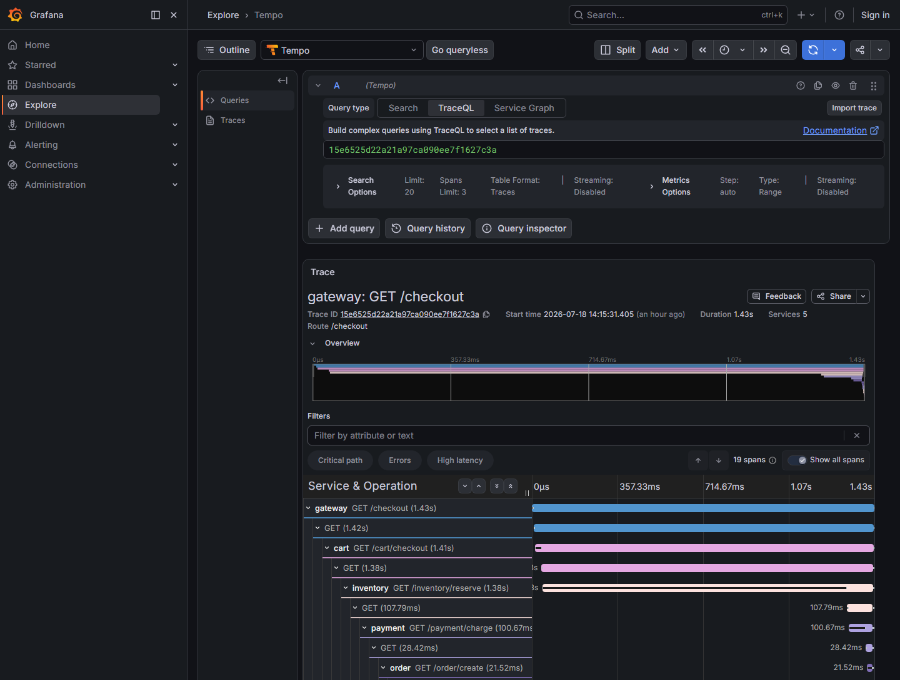

# Trace Pipeline

A runnable demo of a distributed tracing pipeline for a microservices
checkout flow: OpenTelemetry SDKs → OpenTelemetry Collector → Grafana Tempo
(backed by S3-compatible object storage) → Grafana.

New to distributed tracing? [`docs/HOW_IT_WORKS.md`](docs/HOW_IT_WORKS.md)
explains the concepts (spans, trace IDs, auto-instrumentation) and walks
through this exact codebase file by file.

## The scenario

A user hits "checkout". The request fans out through five services:

```
gateway -> cart -> inventory -> payment -> order
```

Each hop is a real HTTP call between containers. One day checkout goes from
under 2s to 3s, and the question is: which of these services is responsible?

To answer that, every service is instrumented with the OpenTelemetry Python
SDK (via `opentelemetry-instrument`, auto-instrumenting FastAPI and httpx).
Each unit of work becomes a **span** (service name, start time, duration),
and every span belonging to one checkout request shares the same **trace
ID**, propagated automatically across the HTTP calls via the `traceparent`
header. That's what lets you reassemble the whole request afterward.

## Architecture

```
 gateway --> cart --> inventory --> payment --> order      (FastAPI + OTel SDK)
    \          \           \            \          /
     \----------\-----------\------------\--------/
                        |
                 OTel Collector (OTLP receiver, batches + tags spans)
                        |
                     Tempo  <-------------------->  MinIO (S3-compatible)
                        |                            (compressed trace blocks)
                     Grafana
              (Explore -> Tempo -> trace timeline)
```

- **Services** (`services/*`) — FastAPI apps, each calling the next hop over
  `httpx`. `opentelemetry-distro` + `opentelemetry-exporter-otlp` are
  installed and `opentelemetry-bootstrap -a install` pulls in matching
  auto-instrumentation for FastAPI/httpx, so no manual span code is needed.
- **otel-collector** (`otel-collector/otel-collector-config.yaml`) — receives
  OTLP over gRPC/HTTP, tags spans with a `deployment.environment` resource
  attribute, batches them, and forwards to Tempo. In a real cluster this same
  config runs as a Kubernetes DaemonSet (one collector per node); Compose has
  no node concept, so here it's a single container.
- **Tempo** (`tempo/tempo.yaml`) — ingests spans and flushes compressed
  blocks straight to an S3 bucket (`storage.trace.backend: s3`).
- **MinIO** — stands in for Amazon S3 locally (same API).
- **Grafana** — pre-provisioned with a Tempo datasource
  (`grafana/provisioning/datasources/tempo.yaml`) so trace search works with
  zero manual setup.

## Running it

Requires Docker with Compose v2.

```bash
docker compose up --build -d
```

Wait ~15-20s for Tempo/collector/services to come up, then trigger a
checkout:

```bash
curl http://localhost:8000/checkout
```

Each call produces one trace spanning all five services.

## Viewing traces

Open Grafana at [http://localhost:3000](http://localhost:3000) (anonymous
admin access, no login needed).

1. Go to **Explore**.
2. Pick the **Tempo** datasource.
3. Use the **Search** query type and hit **Run query** to list recent
   traces, or paste a specific trace ID (returned in the collector's debug
   logs, or by adding `-i` to `curl` and reading the response) into **TraceQL** / **Trace ID** search.
4. Click a trace to see the waterfall — one bar per service, showing exactly
   where the time went.

## Reproducing "checkout got slower"

Inject artificial latency into the `inventory` service and compare the
resulting trace against a normal one:

```bash
INVENTORY_EXTRA_DELAY_MS=1200 docker compose up -d --build inventory
curl http://localhost:8000/checkout
```

In the new trace, the `inventory` span (and everything nested under it —
`payment`, `order`) will visibly balloon, making it obvious in the Grafana
waterfall that inventory is the bottleneck rather than payment or order
downstream of it. Here's an actual trace from this repo, captured with
`INVENTORY_EXTRA_DELAY_MS=1200`: total request time is 1.43s, and the
`inventory GET /inventory/reserve` span alone accounts for 1.38s of it —
everything downstream (payment: 100.67ms, order: 21.52ms) is comparatively
negligible.



Reset with:

```bash
docker compose up -d --build inventory
```

## Reproducing a failed payment

Latency isn't the only thing worth seeing in a trace — failures are too.
Force the `payment` service to decline every charge:

```bash
PAYMENT_FAILURE_RATE=1 docker compose up -d --build payment
curl -i http://localhost:8000/checkout
```

`gateway` now returns `500` (each service calls `resp.raise_for_status()` on
its downstream response, so the failure propagates as a real HTTP error
rather than getting silently swallowed). In the Grafana waterfall, every span
in the chain — `gateway`, `cart`, `inventory`, `payment` — shows up flagged
as an error, but only the `payment` span carries the actual cause: it's
annotated by hand (`span.record_exception(...)`, `span.set_status(...)`)
with the exception message `payment provider declined the charge` and a
`payment.outcome=declined` attribute, since that's business logic no
auto-instrumentation library could know about. Every span above it is
red too, but for a different reason — it's just reporting "my downstream
call failed." That distinction (root cause vs. blast radius) is exactly what
you lose without tracing and get walking a single request tree with one.

Reset with:

```bash
docker compose up -d --build payment
```

## Tearing down

```bash
docker compose down -v
```

(`-v` also drops the MinIO and Tempo WAL volumes.)
